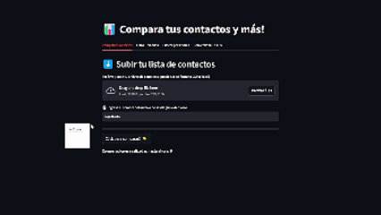

# Excel File Processor Application

This application processes Excel files by matching and sorting data, and it provides a user-friendly interface built with streamlit.
<p align="center">
  
</p>

## Setup Instructions

Follow these steps to set up your environment, run the application, and package it into an executable file.

### 1. Create and Activate a Virtual Environment (Recommended)

It’s recommended to use a virtual environment to manage dependencies.

```bash
python -m venv venv
source venv/bin/activate  # On Windows, use: venv\Scripts\activate
```

Install the necessary Python packages to run the application:

try:

```bash
pip install -r requirements.txt
```

To run the application, execute:

```bash
streamlit run main.py
```
